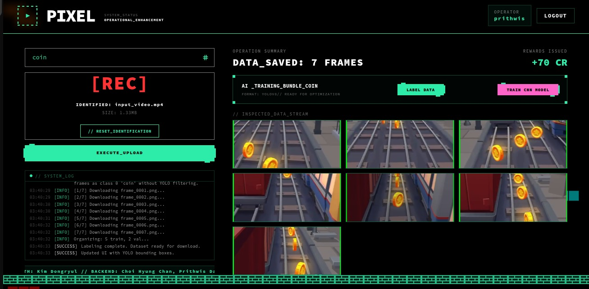

# Unlocking the World's Video: How PIXEL Democratizes Computer Vision Training

**Author:** PIXEL Development Team  
**Platform:** [builder.aws.com](http://builder.aws.com)

---

## The Hidden Goldmine of Unstructured Video

In the rapidly evolving world of Computer Vision, there’s a recurring paradox: while foundational models are easier to access than ever, the **specialized datasets** required to train them for niche tasks remain prohibitively difficult to build. 

Whether you’re an indie game developer trying to detect specific assets, a researcher studying urban patterns, or a curious hobbyist, you usually face a binary choice: spend thousands of dollars on manual annotation services, or spend weeks tediously dragging boxes over thousands of frames yourself.

But there is a better way. **PIXEL** was built on the premise that the information we need is already out there, "trapped" in video format—from gameplay recordings to documentaries. By using **Amazon Nova AI** to bridge the gap between "unstructured pixels" and "structured datasets," we are democratizing the ability to build custom AI.

*Visualizing the result: PIXEL identifies, curates, and auto-labels niche concepts directly from gaming footage.*

## How PIXEL Positively Affects the Developer Community

PIXEL is more than just a pipeline; it’s a **force multiplier** for builders. Its impact on the community centers on three key areas:

### 1. Removing the "Annotation Tax"
For many developers, the high cost of data labeling is a "tax" that kills promising projects before they even start. By combining **Amazon Nova-2-Lite** for intelligent frame curation with **YOLOv8** for zero-shot labeling, PIXEL provides a "cold start" for datasets. You can go from an idea and a video to a working prototype in minutes, not weeks.

### 2. Democratizing Niche AI
Standard datasets exist for common objects like cars and people. But what if you want to detect a specific type of vintage jacket, a rare bird, or a unique UI element in a game? PIXEL empowers anyone with a camera or a screen recorder to create datasets for **long-tail concepts** that the tech industry has overlooked.

### 3. Rapid Prototyping and Feedback
The built-in PyTorch training dashboard gives developers immediate feedback. You don't just get a dataset; you see how a model learns from it in real-time. This reduces the iteration cycle, allowing teams to fail fast and pivot quickly.

## Real-World Applications: From Screen to Reality

We envision PIXEL being used across diverse sectors:

*   **Game Development:** Studios can record hundreds of hours of playtesting and use PIXEL to automatically build testers that can detect visual bugs, clipping, or specific player behaviors.
*   **Scientific Research:** Ecologists can process thousands of hours of trail camera footage, using Nova AI to skip the hours of "empty" frames and build detectors for specific species automatically.
*   **Retail & Fashion:** Small businesses can use footage from fashion shows or street-style videos to build custom inventory-tagging models without needing a corporate-scale ML team.

## Our Roadmap for Encouraging Adoption

We want PIXEL to be the default starting point for video-based ML. To encourage adoption, our plan includes:

*   **Open Source Foundation:** The PIXEL core is fully open-source. We believe the community will build the best plugins for diverse video sources.
*   **The "Keyword Exchange":** We plan to launch a community repository of optimized Amazon Nova prompts and keyword mappings, allowing users to share "recipes" for specific object categories.
*   **AWS AWS SageMaker "One-Click" Export:** We are working on a seamless bridge to AWS SageMaker, allowing users to take their PIXEL-generated datasets and scale up to massive production training sessions with a single click.
*   **Developer Tutorials:** We are launching a series of walkthroughs showing how to use PIXEL for specific use cases, like "Building a GTA-V Vehicle Dataset in 10 Minutes."

## Join the Revolution

The "knowledge gap" in ML is a data problem, and the solution is already hidden in our videos. With the power of **Amazon Bedrock** and **Nova AI**, PIXEL unlocks that data for everyone.

**Start building today at [GitHub](https://github.com/Prithwis-2023/PixelAI/)**
