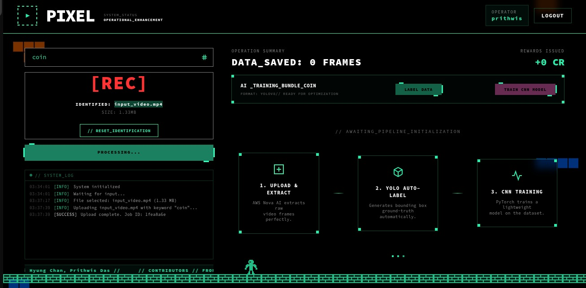
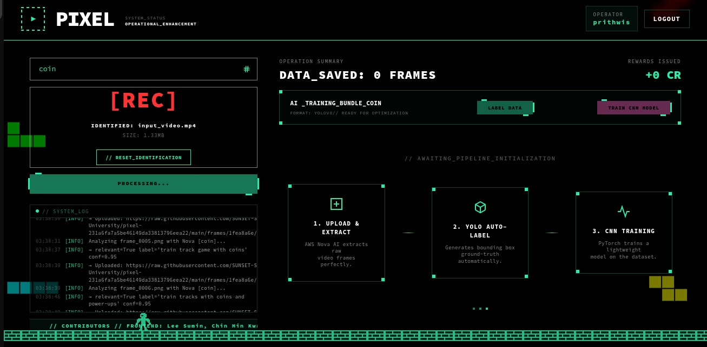
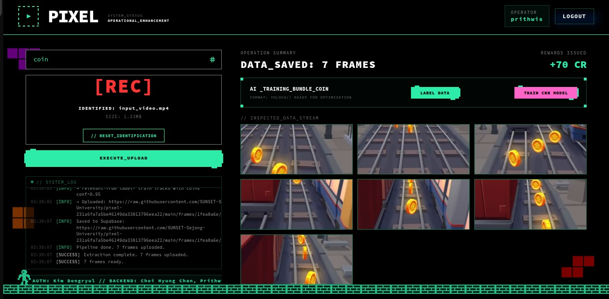
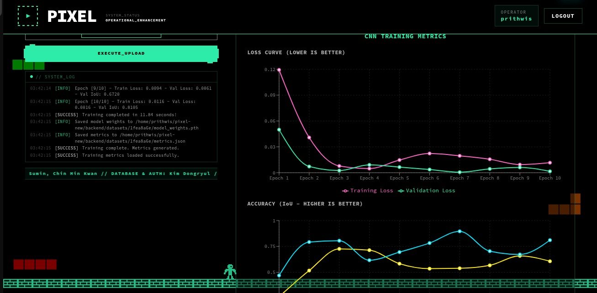

# 🎞️ Pixel: The Video-to-Dataset Engine

> Bridge the model knowledge gap by turning any video into a labeled, training-ready object detection dataset. Powered by AWS Nova, YOLOv8, and a custom PyTorch CNN.

---

## 📌 Overview

**Pixel AI** is a full-stack web application that automates the creation of machine-learning datasets from raw video footage. A user uploads a video and specifies a keyword (e.g. `car`, `person`, `cat`). The backend then:

1. **Extracts frames** from the video using FFmpeg.
2. **Deduplicates frames** with SSIM (Structural Similarity Index) to eliminate redundant shots.
3. **Filters frames** using **AWS Nova AI** to keep only those relevant to the specified keyword.
4. **Uploads relevant frames** to a **GitHub CDN repository** for persistent, accessible storage.
5. **Records metadata** (frame count, CDN URL) in **Supabase**.
6. **Auto-labels frames** using **YOLOv8** (mapped to COCO class IDs).
7. **Trains a lightweight PyTorch CNN** (bounding-box regressor) on the labeled dataset.
8. **Serves metrics, annotated previews, and a downloadable dataset ZIP** back to the frontend.

The frontend provides a real-time dashboard with live log streaming (SSE), an interactive frame gallery with bounding-box visualizations, and a training metrics chart.

---

## 🎯 The Problem Pixel Solves: "I Have a Video, But No Dataset"

Training an object detection model requires **large quantities of labeled images** — but for most real-world concepts, those labeled datasets simply don't exist.

Imagine you want to train a model to detect **red jackets**. There's no standard dataset for that. But maybe you found a film, a music video, or a documentary where characters are wearing exactly what you need. Previously, that video was useless to you as a training resource — the manual effort to extract frames, curate, annotate, and organize them into a training-ready format was simply too high.

**Pixel AI turns that video directly into a production-ready ML dataset.**

```
  🎬 Any Video (film, music video, gameplay, documentary, screen recording)
          │  keyword: "red jacket"
          ▼
  🤖 Pixel AI Pipeline
          │  Nova AI filters relevant frames → YOLOv8 labels them
          ▼
  📦 Production-ready YOLO Dataset (.zip)
     ├── train/images/  ── train/labels/
     ├── val/images/    ── val/labels/
     └── data.yaml      ── metrics.json
```

This directly alleviates the **knowledge gap** in your model: instead of either abandoning niche concepts because datasets don't exist, or spending weeks on manual annotation, you give Pixel a video and a keyword and walk away with a labeled dataset.

**Example use cases:**
| What you have | What you need | Keyword |
|---|---|---|
| Racing game footage | Vehicle detection dataset | `car` |
| Fashion film / music video | Specific clothing detector | `red jacket` |
| Wildlife documentary | Animal detection dataset | `elephant` |
| FPS game recording | Character detection dataset | `person` |
| Security camera demo | Bag detection dataset | `backpack` |
| Any video you can find | Anything visible in that video | Your keyword |

---

## ✨ Why Pixel is Unique

Most dataset tools focus on one step: annotation editors, scraping utilities, or training dashboards — but none connect the entire pipeline. Pixel AI is unique because:

| Feature | Pixel AI | Traditional Approach |
|---------|----------|----------------------|
| **Source** | Any video (gaming, real-world, recorded) | Manual image collection |
| **Smart Frame Selection** | AWS Nova AI filters for keyword relevance + SSIM deduplication | Manual curation |
| **Auto-Labeling** | YOLOv8 COCO zero-shot labeling | Manual annotation tools (LabelImg, Roboflow) |
| **CDN Storage** | Auto-creates per-user GitHub CDN repos | Self-managed storage |
| **Model Training** | Built-in lightweight CNN trained in-browser pipeline | Separate training infrastructure |
| **End-to-end** | Upload → Dataset ZIP + trained model in one session | Multiple disconnected tools |
| **Real-time Feedback** | SSE live log stream, annotated frame previews, epoch charts | None |

The key innovation is the **AI-powered curation layer**: instead of extracting every frame blindly, Pixel uses **AWS Nova** to intelligently decide which frames are actually useful for training a detector for your specific keyword — dramatically improving dataset quality and reducing noise.

---

## 🧱 Architecture

```
┌─────────────────────────────────────────────────────────────────┐
│                        Frontend (React + Vite)                  │
│  Sidebar: Keyword input, video upload, live logs                │
│  MainPanel: Frame gallery, annotated frames, training charts    │
└────────────────────────┬────────────────────────────────────────┘
                         │ HTTP + SSE
┌────────────────────────▼────────────────────────────────────────┐
│                  Backend (FastAPI + Uvicorn)                    │
│  /upload  →  /process  →  /stream (SSE)  →  /label  →  /train   │
└────┬──────────────┬─────────────────┬──────────────────────────-┘
     │              │                 │
  AWS Bedrock    GitHub API       Supabase
  (Nova AI)     (CDN Storage)    (Metadata DB)
```

---

## 🗂️ Project Structure

```
pixel-new/
├── backend/
│   ├── main.py                   # FastAPI app, all API routes and job orchestration
│   ├── extract_frames_nova.py    # Frame extraction, SSIM dedup, Nova AI filter, GitHub/Supabase upload
│   ├── label_frames_yolo.py      # YOLOv8 inference, YOLO-format label file generation
│   ├── train_lightweight_cnn.py  # PyTorch BBoxRegressor CNN training
│   ├── train_yolo.py             # (Utility) YOLOv8 fine-tune script
│   ├── requirements.txt
│   └── app/
│       ├── api/
│       │   ├── dependencies.py   # JWT auth dependency
│       │   └── v1/
│       │       ├── auth.py       # Login / signup endpoints
│       │       └── users.py      # User profile endpoints
│       ├── core/                 # Config and security helpers
│       ├── db/                   # SQLAlchemy engine + session
│       ├── models/               # SQLAlchemy ORM models (User)
│       ├── schemas/              # Pydantic request/response schemas
│       └── services/             # Business logic layer
├── frontend/
│   ├── src/
│   │   ├── App.tsx               # Root component, full state machine + SSE logic
│   │   ├── components/
│   │   │   ├── Header.tsx        # Navigation bar with auth buttons
│   │   │   ├── Sidebar.tsx       # Keyword input, upload, execute button, system log
│   │   │   ├── MainPanel.tsx     # Frame gallery, annotated view, training charts
│   │   │   ├── AuthModal.tsx     # Login / Signup modal
│   │   │   ├── RecBox.tsx        # Video file drop / select box
│   │   │   ├── SearchInput.tsx   # Keyword tag input
│   │   │   ├── SystemLog.tsx     # Real-time log display
│   │   │   ├── PixelBackground.tsx # Animated canvas background
│   │   │   └── CreditsMarquee.tsx  # Scrolling contributors bar
│   │   ├── api/
│   │   │   └── auth.ts           # Auth API helper functions
│   │   ├── styles/               # Component-scoped style objects
│   │   ├── types/                # Shared TypeScript types
│   │   └── constants.ts          # API base URL, token key
│   ├── index.html
│   ├── package.json
│   └── vite.config.ts
└── .env                          # Environment variables (not committed)
```

---

## ⚙️ Tech Stack

### Backend
| Technology | Role |
|---|---|
| **FastAPI** | REST API framework with async support |
| **Uvicorn** | ASGI server |
| **AWS Bedrock (Nova AI)** | AI-powered frame relevance filtering |
| **YOLOv8 (Ultralytics)** | Object detection & YOLO-format auto-labeling |
| **PyTorch** | Custom lightweight CNN training (bounding box regression) |
| **FFmpeg + OpenCV** | Video frame extraction and SSIM deduplication |
| **GitHub API** | CDN storage for extracted frames (raw.githubusercontent.com) |
| **Supabase** | Metadata persistence (frame counts, CDN URLs) |
| **SQLAlchemy + SQLite** | Local user auth persistence |
| **python-jose + bcrypt** | JWT authentication & password hashing |
| **SSE (Server-Sent Events)** | Real-time log streaming to the frontend |

### Frontend
| Technology | Role |
|---|---|
| **React 19** | UI framework |
| **TypeScript** | Type safety |
| **Vite** | Dev server & bundler |
| **Tailwind CSS v4** | Utility-first styling |
| **Recharts** | Training metrics visualization |
| **EventSource API** | Live log streaming from the backend SSE endpoint |

---

## 🔄 Pipeline: Step by Step

### 1. Upload
`POST /upload` — Accepts a video file and keyword. Saves the video to disk, returns a `job_id`.



### 2. Frame Extraction & AI Filtering
`POST /process/{job_id}` — Triggers the background pipeline in `extract_frames_nova.py`:
- Extract frames at 2 FPS using **FFmpeg**
- Deduplicate consecutive similar frames using **SSIM** (threshold: 0.50)
- Send each unique frame to **AWS Nova (amazon.nova-2-lite-v1)** with a prompt asking if the frame is relevant for training a `{keyword}` detection model
- Upload relevant frames to a per-user **GitHub repository** as CDN-served raw images
- Record the base CDN URL and frame count in **Supabase**




Progress is streamed to the frontend in real time via `GET /stream/{job_id}` (SSE).

### 3. YOLO Labeling
`POST /label/{job_id}` — Triggered by the user after extraction completes:
- Downloads frames from the GitHub CDN
- Maps the keyword to a **COCO class ID** (e.g. `car` → class 2)
- Runs **YOLOv8n** inference and generates YOLO-format `.txt` label files
- Saves annotated frame images (with bounding boxes) for the frontend gallery
- Organizes the dataset into `train/` (80%) and `val/` (20%) splits
- Writes a `data.yaml` compatible with YOLO trainers


### 4. CNN Training
`POST /train/{job_id}` — Trains a custom lightweight **PyTorch BBoxRegressor** CNN:
- 3-layer convolutional feature extractor (16→32→64 channels)
- Fully connected regression head outputting `[x_center, y_center, width, height]`
- **MSE Loss**, **Adam optimizer**, data augmentation (ColorJitter)
- Trains for 10 epochs, computes **IoU** per epoch
- Saves `model_weights.pth` and `metrics.json`



### 5. Results & Download
- `GET /metrics/{job_id}` — Returns the training metrics JSON (loss & IoU per epoch)
- `GET /annotated/{job_id}` — Returns URLs to annotated frame images
- `GET /download/{job_id}` — Streams the full labeled dataset as a ZIP file

---

## 🔐 Authentication

The application uses **JWT-based authentication**:
- `POST /api/v1/auth/signup` — Register with a `user_login_id` and password
- `POST /api/v1/auth/login` — Returns a Bearer token
- `GET /api/v1/users/me` — Returns the currently authenticated user's profile

Protected routes (`/upload`, `/process`, `/label`, `/train`, `/metrics`) require an `Authorization: Bearer <token>` header. The frontend stores the token in `localStorage` and restores the session automatically on page load.

---

## 🚀 Getting Started

### Prerequisites
- Python 3.10+
- Node.js 20+
- FFmpeg installed and on PATH
- AWS credentials configured (for Bedrock / Nova access)
- A GitHub personal access token with `repo` scope
- A Supabase project

### 1. Clone and set up environment variables

```bash
git clone https://github.com/<your-org>/pixel-new.git
cd pixel-new
cp .env.example .env   # Edit .env with your credentials
```

**Required `.env` variables:**
```env
AWS_REGION=us-east-1

GITHUB_TOKEN=ghp_...
GITHUB_REPO=your-org/pixel-frames
GITHUB_BRANCH=main

SUPABASE_URL=https://xxxx.supabase.co
SUPABASE_KEY=your-supabase-anon-key
SUPABASE_TABLE=video_storage

SECRET_KEY=your-jwt-secret-key
```

### 2. Start the backend

```bash
cd pixel-new
python -m venv .venv
source .venv/bin/activate
pip install -r backend/requirements.txt

cd backend
uvicorn main:app --host 0.0.0.0 --port 8000 --reload
```

The backend will be available at `http://localhost:8000`.

### 3. Start the frontend

```bash
cd frontend
npm install
npm run dev
```

The frontend dev server will start at `http://localhost:5173`.

---

## 📡 API Reference

| Method | Endpoint | Auth | Description |
|--------|----------|------|-------------|
| `POST` | `/upload` | ✅ | Upload video + keyword, receive `job_id` |
| `POST` | `/process/{job_id}` | ✅ | Start frame extraction + Nova pipeline |
| `GET` | `/stream/{job_id}` | ❌ | SSE log stream for the active pipeline |
| `GET` | `/status/{job_id}` | ❌ | Poll current job status |
| `GET` | `/frames/{job_id}` | ❌ | List extracted frame CDN URLs |
| `POST` | `/label/{job_id}` | ✅ | Trigger YOLOv8 auto-labeling |
| `POST` | `/train/{job_id}` | ✅ | Trigger PyTorch CNN training |
| `GET` | `/metrics/{job_id}` | ✅ | Fetch training metrics JSON |
| `GET` | `/annotated/{job_id}` | ❌ | Fetch annotated frame image URLs |
| `GET` | `/download/{job_id}` | ❌ | Download labeled dataset as ZIP |
| `GET` | `/health` | ❌ | Health check |
| `POST` | `/api/v1/auth/signup` | ❌ | Register a new user |
| `POST` | `/api/v1/auth/login` | ❌ | Log in and receive JWT |
| `GET` | `/api/v1/users/me` | ✅ | Get current user info |

---

## 👥 Contributors

| Name | Role |
|------|------|
| **Prithwis Das** | Backend |
| **Choi Hyung Chan** | Backend |
| **Kim Dongryul** | Database & Authentication |
| **Lee Sumin** | Frontend |
| **Chin Min Kwan** | Frontend |

---

## 📄 License

This project is for educational and research purposes. Please check with the project maintainers for licensing details.
